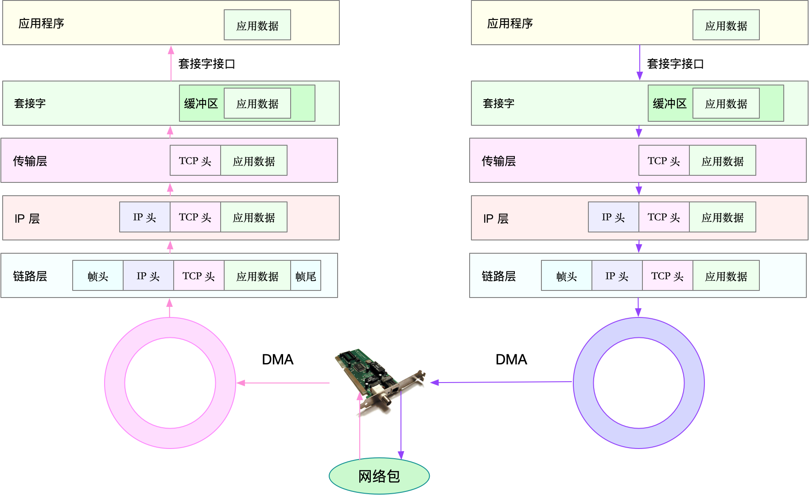

### 套路篇：如何迅速分析出系统I/O的瓶颈在哪里？

1. 概念


文件系统和磁盘IO问题分析流程：


2. 涉及到的命令

```shell

```

3. 结论

> 


### 套路篇：磁盘 I/O 性能优化的几个思路

1. 概念


2. 涉及到的命令

```shell
# 随机读
fio -name=randread -direct=1 -iodepth=64 -rw=randread -ioengine=libaio -bs=4k -size=1G -numjobs=1 -runtime=1000 -group_reporting -filename=/dev/sdb

# 随机写
fio -name=randwrite -direct=1 -iodepth=64 -rw=randwrite -ioengine=libaio -bs=4k -size=1G -numjobs=1 -runtime=1000 -group_reporting -filename=/dev/sdb

# 顺序读
fio -name=read -direct=1 -iodepth=64 -rw=read -ioengine=libaio -bs=4k -size=1G -numjobs=1 -runtime=1000 -group_reporting -filename=/dev/sdb

# 顺序写
fio -name=write -direct=1 -iodepth=64 -rw=write -ioengine=libaio -bs=4k -size=1G -numjobs=1 -runtime=1000 -group_reporting -filename=/dev/sdb

# fio 支持 I/O 的重放。借助前面提到过的 blktrace，再配合上 fio，就可以实现对应用程序 I/O 模式的基准测试。你需要先用 blktrace ，记录磁盘设备的 I/O 访问情况；然后使用 fio ，重放 blktrace 的记录。

# 使用blktrace跟踪磁盘I/O，注意指定应用程序正在操作的磁盘
$ blktrace /dev/sdb

# 查看blktrace记录的结果
# ls
sdb.blktrace.0 sdb.blktrace.1

# 将结果转化为二进制文件
$ blkparse sdb -d sdb.bin

# 使用fio重放日志
$ fio --name=replay --filename=/dev/sdb --direct=1 --read_iolog=sdb.bin
```

3. 结论

> 磁盘和文件系统的 I/O ，通常是整个系统中最慢的一个模块。所以，在优化 I/O 问题时，除了可以优化 I/O 的执行流程，还可以借助更快的内存、网络、CPU 等，减少 I/O 调用。
>
> 比如，你可以充分利用系统提供的 Buffer、Cache ，或是应用程序内部缓存， 再或者 Redis 这类的外部缓存系统。

### 答疑（四）：阻塞、非阻塞 I/O 与同步、异步 I/O 的区别和联系

1. 概念

> 阻塞 / 非阻塞和同步 / 异步，其实就是两个不同角度的 I/O 划分方式。它们描述的对象也不同，阻塞 / 非阻塞针对的是 I/O 调用者（即应用程序），而同步 / 异步针对的是 I/O 执行者（即系统）。

2. 涉及到的命令

```shell

```

3. 结论

> 

### 关于 Linux 网络，你必须知道这些（上）

1. 概念

> 同 CPU、内存以及 I/O 一样，网络也是 Linux 系统最核心的功能。网络是一种把不同计算机或网络设备连接到一起的技术，它本质上是一种进程间通信方式，特别是跨系统的进程间通信，必须要通过网络才能进行。随着高并发、分布式、云计算、微服务等技术的普及，网络的性能也变得越来越重要。




2. 涉及到的命令

```shell

```

3. 结论

> TCP/IP 模型，把网络互联的框架，分为应用层、传输层、网络层、网络接口层等四层，这也是 Linux 网络栈最核心的构成部分。

### 

### 关于 Linux 网络，你必须知道这些（下）

1. 概念

> 实际上，我们通常用带宽、吞吐量、延时、PPS（Packet Per Second）等指标衡量网络的性能。
>
> - 带宽，表示链路的最大传输速率，单位通常为 b/s （比特 / 秒）。
> - 吞吐量，表示单位时间内成功传输的数据量，单位通常为 b/s（比特 / 秒）或者 B/s（字节 / 秒）。吞吐量受带宽限制，而吞吐量 / 带宽，也就是该网络的使用率。
> - 延时，表示从网络请求发出后，一直到收到远端响应，所需要的时间延迟。在不同场景中，这一指标可能会有不同含义。比如，它可以表示，建立连接需要的时间（比如 TCP 握手延时），或一个数据包往返所需的时间（比如 RTT）。
> - PPS，是 Packet Per Second（包 / 秒）的缩写，表示以网络包为单位的传输速率。PPS 通常用来评估网络的转发能力，比如硬件交换机，通常可以达到线性转发（即 PPS 可以达到或者接近理论最大值）。而基于 Linux 服务器的转发，则容易受网络包大小的影响。
>
> 除了这些指标，网络的可用性（网络能否正常通信）、并发连接数（TCP 连接数量）、丢包率（丢包百分比）、重传率（重新传输的网络包比例）等也是常用的性能指标。

2. 涉及到的命令

```shell
# ifconfig 和 ip 分别属于软件包 net-tools 和 iproute2，iproute2 是 net-tools 的下一代。通常情况下它们会在发行版中默认安装。但如果你找不到 ifconfig 或者 ip 命令，可以安装这两个软件包。

# 更推荐使用 ip 工具，因为它提供了更丰富的功能和更易用的接口。

# head -n 3 表示只显示前面3行
# -l 表示只显示监听套接字
# -n 表示显示数字地址和端口(而不是名字)
# -p 表示显示进程信息
$ netstat -nlp | head -n 3
Active Internet connections (only servers)
Proto Recv-Q Send-Q Local Address Foreign Address State PID/Program name
tcp 0 0 127.0.0.53:53 0.0.0.0:* LISTEN 840/systemd-resolve

# -l 表示只显示监听套接字
# -t 表示只显示 TCP 套接字
# -n 表示显示数字地址和端口(而不是名字)
# -p 表示显示进程信息
$ ss -ltnp | head -n 3
State Recv-Q Send-Q Local Address:Port Peer Address:Port
LISTEN 0 128 127.0.0.53%lo:53 0.0.0.0:* users:(("systemd-resolve",pid=840,fd=13))
LISTEN 0 128 0.0.0.0:22 0.0.0.0:* users:(("sshd",pid=1459,fd=3))

# 使用 netstat 或 ss ，也可以查看协议栈的信息
$ netstat -s

$ ss -s


# sar 增加 -n 参数就可以查看网络的统计信息，比如网络接口（DEV）、网络接口错误（EDEV）、TCP、UDP、ICMP 等等
# 数字1表示每隔1秒输出一组数据
$ sar -n DEV 1

# 通常使用 ping ，来测试远程主机的连通性和延时
# -c3表示发送三次ICMP包后停止
$ ping -c3 114.114.114.114
```

3. 结论

> 

### 基础篇：C10K 和 C1000K回顾

1. 概念

> I/O多路复用
>
> 第一种，使用非阻塞 I/O 和水平触发通知，比如使用 select 或者 poll。
>
> 第二种，使用非阻塞 I/O 和边缘触发通知，比如 epoll。
>
> 第三种，使用异步 I/O（Asynchronous I/O，简称为 AIO）。


> C10M问题
>
> 究其根本，还是 Linux 内核协议栈做了太多太繁重的工作。从网卡中断带来的硬中断处理程序开始，到软中断中的各层网络协议处理，最后再到应用程序，这个路径实在是太长了，就会导致网络包的处理优化，到了一定程度后，就无法更进一步了。要解决这个问题，最重要就是跳过内核协议栈的冗长路径，把网络包直接送到要处理的应用程序那里去。这里有两种常见的机制，DPDK 和 XDP。

2. 涉及到的命令

```shell

```

3. 结论

> 从 C10K 到 C100K ，可能只需要增加系统的物理资源就可以满足；
>
> 但从 C100K 到 C1000K ，就不仅仅是增加物理资源就能解决的问题了。这时，就需要多方面的优化工作了，从硬件的中断处理和网络功能卸载、到网络协议栈的文件描述符数量、连接状态跟踪、缓存队列等内核的优化，再到应用程序的工作模型优化，都是考虑的重点。
>
> 再进一步，要实现 C10M ，就不只是增加物理资源，或者优化内核和应用程序可以解决的问题了。这时候，就需要用 XDP 的方式，在内核协议栈之前处理网络包；或者用 DPDK 直接跳过网络协议栈，在用户空间通过轮询的方式直接处理网络包。

### 套路篇：怎么评估系统的网络性能

1. 概念

> 

2. 涉及到的命令

```shell
# Linux 内核自带的高性能网络测试工具 pktgen。pktgen 支持丰富的自定义选项，方便你根据实际需要构造所需网络包，从而更准确地测试出目标服务器的性能。

# iperf 和 netperf 都是最常用的网络性能测试工具，测试 TCP 和 UDP 的吞吐量。它们都以客户端和服务器通信的方式，测试一段时间内的平均吞吐量。

# ab 是 Apache 自带的 HTTP 压测工具，主要测试 HTTP 服务的每秒请求数、请求延迟、吞吐量以及请求延迟的分布情况等。

# 为了得到应用程序的实际性能，就要求性能工具本身可以模拟用户的请求负载，而 iperf、ab 这类工具就无能为力了。幸运的是，我们还可以用 wrk、TCPCopy、Jmeter 或者 LoadRunner 等实现这个目标。
```

3. 结论

> 

### 