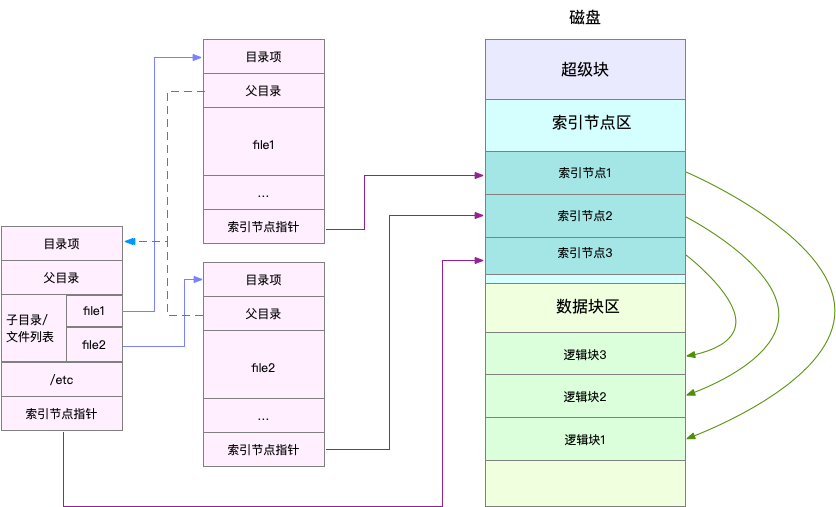

### 基础篇：Linux 文件系统是怎么工作的？

1. 概念

> 磁盘为系统提供了最基本的持久化存储。

> 文件系统则在磁盘的基础上，提供了一个用来管理文件的树状结构。

> **你要记住最重要的一点，在 Linux 中一切皆文件。不仅普通的文件和目录，就连块设备、套接字、管道等，也都要通过统一的文件系统来管理。**

> 为了方便管理，Linux 文件系统为每个文件都分配两个数据结构，索引节点（index node）和目录项（directory entry）。它们主要用来记录文件的元信息和目录结构。
>
> - 索引节点，简称为 inode，用来记录文件的元数据，比如 inode 编号、文件大小、访问权限、修改日期、数据的位置等。索引节点和文件一一对应，它跟文件内容一样，都会被持久化存储到磁盘中。所以记住，索引节点同样占用磁盘空间。
> - 目录项，简称为 dentry，用来记录文件的名字、索引节点指针以及与其他目录项的关联关系。多个关联的目录项，就构成了文件系统的目录结构。不过，不同于索引节点，目录项是由内核维护的一个内存数据结构，所以通常也被叫做目录项缓存。




> 目录项、索引节点、逻辑块以及超级块，构成了 Linux 文件系统的四大基本要素。不过，为了支持各种不同的文件系统，Linux 内核在用户进程和文件系统的中间，又引入了一个抽象层，也就是虚拟文件系统 VFS（Virtual File System）。


> 文件读写方式的各种差异，导致 I/O 的分类多种多样。最常见的有，缓冲与非缓冲 I/O、直接与非直接 I/O、阻塞与非阻塞 I/O、同步与异步 I/O 等。

2. 涉及到的命令

```shell
# 查看文件系统的磁盘空间使用情况
$ df -h /dev/sda1

# 查看索引节点的使用情况
$ df -i /dev/sda1

# 查看所有目录项和各种文件系统索引节点的缓存情况
$ cat /proc/slabinfo | grep -E '^#|dentry|inode'

# 找到占用内存最多的缓存类型
# 按下c按照缓存大小排序，按下a按照活跃对象数排序 
$ slabtop
```

3. 结论

> 文件系统，是对存储设备上的文件，进行组织管理的一种机制。为了支持各类不同的文件系统，Linux 在各种文件系统实现上，抽象了一层虚拟文件系统（VFS）。
>
> VFS 定义了一组所有文件系统都支持的数据结构和标准接口。这样，用户进程和内核中的其他子系统，就只需要跟 VFS 提供的统一接口进行交互。
>
> 为了降低慢速磁盘对性能的影响，文件系统又通过页缓存、目录项缓存以及索引节点缓存，缓和磁盘延迟对应用程序的影响。


### 基础篇：Linux 磁盘I/O是怎么工作的（上）

1. 概念

> 机械磁盘，也称为硬盘驱动器（Hard Disk Driver），通常缩写为 HDD。机械磁盘主要由盘片和读写磁头组成，数据就存储在盘片的环状磁道中。在读写数据前，需要移动读写磁头，定位到数据所在的磁道，然后才能访问数据。显然，如果 I/O 请求刚好连续，那就不需要磁道寻址，自然可以获得最佳性能。这其实就是我们熟悉的，连续 I/O 的工作原理。与之相对应的，当然就是随机 I/O，它需要不停地移动磁头，来定位数据位置，所以读写速度就会比较慢。
>
> 固态磁盘（Solid State Disk），通常缩写为 SSD，由固态电子元器件组成。固态磁盘不需要磁道寻址，所以，不管是连续 I/O，还是随机 I/O 的性能，都比机械磁盘要好得多。

> 连续 I/O 性能要比随机 I/O 好得多
>
> - 机械磁盘的最小读写单位是扇区，一般大小为 512 字节。
> - 而固态磁盘的最小读写单位是页，通常大小是 4KB、8KB 等。

> 另一个比较常用的架构，是把多块磁盘组合成一个逻辑磁盘，构成冗余独立磁盘阵列，也就是 RAID（Redundant Array of Independent Disks），从而可以提高数据访问的性能，并且增强数据存储的可靠性。根据容量、性能和可靠性需求的不同，RAID 一般可以划分为多个级别，如 RAID0、RAID1、RAID5、RAID10 等。
>
> - RAID0 有最优的读写性能，但不提供数据冗余的功能。
> - 而其他级别的 RAID，在提供数据冗余的基础上，对读写性能也有一定程度的优化。

> 在 Linux 中，**磁盘实际上是作为一个块设备来管理的**，也就是以块为单位读写数据，并且支持随机读写。每个块设备都会被赋予两个设备号，分别是主、次设备号。主设备号用在驱动程序中，用来区分设备类型；而次设备号则是用来给多个同类设备编号。

2. 涉及到的命令

```shell

```

3. 结论

> 通用块层是 Linux 磁盘 I/O 的核心。向上，它为文件系统和应用程序，提供访问了块设备的标准接口；向下，把各种异构的磁盘设备，抽象为统一的块设备，并会对文件系统和应用程序发来的 I/O 请求进行重新排序、请求合并等，提高了磁盘访问的效率。

### 基础篇：Linux 磁盘I/O是怎么工作的（下）

1. 概念

> 衡量磁盘性能的基本指标。
>
> - 使用率，是指磁盘处理 I/O 的时间百分比。过高的使用率（比如超过 80%），通常意味着磁盘 I/O 存在性能瓶颈。
> - 饱和度，是指磁盘处理 I/O 的繁忙程度。过高的饱和度，意味着磁盘存在严重的性能瓶颈。当饱和度为 100% 时，磁盘无法接受新的 I/O 请求。
> - IOPS（Input/Output Per Second），是指每秒的 I/O 请求数。
> - 吞吐量，是指每秒的 I/O 请求大小。
> - 响应时间，是指 I/O 请求从发出到收到响应的间隔时间。

> 

2. 涉及到的命令

```shell
# iostat 是最常用的磁盘 I/O 性能观测工具，它提供了每个磁盘的使用率、IOPS、吞吐量等各种常见的性能指标，当然，这些指标实际上来自 /proc/diskstats。
# -d -x表示显示所有磁盘I/O的指标
$ iostat -d -x 1
```


```
$ pidstat -d 1

$ iotop
```


3. 结论

> 可以用 iostat 获得磁盘的 I/O 情况，也可以用 pidstat、iotop 等观察进程的 I/O 情况。不过在分析这些性能指标时，你要注意结合读写比例、I/O 类型以及 I/O 大小等，进行综合分析。


### 案例篇：如何找出狂打日志的内鬼？

1. 概念

> kworker 是一个内核线程，而 jbd2 是 ext4 文件系统中，用来保证数据完整性的内核线程。他们都是保证文件系统基本功能的内核线程，所以具体细节暂时就不用管了，我们只需要明白，它们延迟的根源还是大量 I/O。

2. 涉及到的命令

```shell
# -d表示显示I/O性能指标，-x表示显示扩展统计（即所有I/O指标） 
$ iostat -x -d 1

# 查看进程打开文件列表，不过，这里的“文件”不只有普通文件，还包括了目录、块设备、动态库、网络套接字等。
$ lsof -p 18940

# 在终端中运行下面的 kill 命令，给进程 18940 发送 SIGUSR2 信号
$ kill -SIGUSR2 18940

```

3. 结论

> 