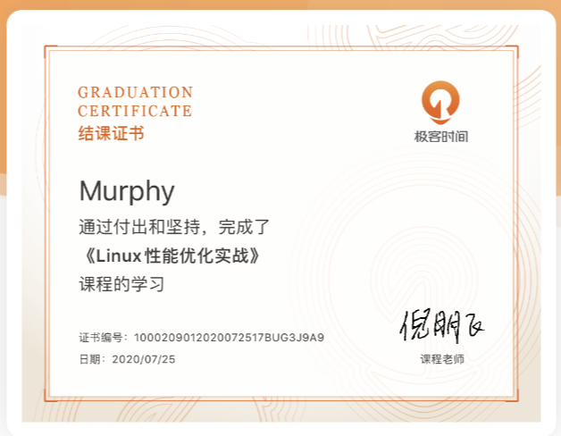

### 总结

不知不觉就来到了这次读书活动的尾声，在整个过程中学到了很多东西，但更加认识到了自己的不足。在课程刚开始的时候，还可以跟得上，后面就只能勉强跟上了。跟着老师学习完一遍算是让我有了一个整体的思路，以后再遇到服务器的性能问题，就有头绪了，也有资料来查询解决方法了。

老师提供的实例教程非常有用，让我可以从问题着手，思考性能问题出现的原因，然后利用相关的工具去查询对应的指标，去定位导致问题的bug，进而去解决问题。在实践的过程中，我也仅仅是跟随老师的思路过了一遍，课程结束后，还得多多练习，熟悉各种套路，各种工具，才能真正学到一些解决Linux性能问题的思路。

老师推荐的一些书籍，说实话，都听说过，下载过电子版，也买过几本实体书，也开始学习过几天，不过都半途而废了，反而去追寻一些xxx实践、xxx应用的书籍，就是因为这些书太厚太难了。不过老师的话，也让我再一次认识到，这些基础的东西才是最重要的，是能经得起时间考验的，学会了这些，再去学习其它技术，会更加迅速。后面还是要认认真真把老师推荐的基础书籍都好好啃一遍。

最后，晒一下：

