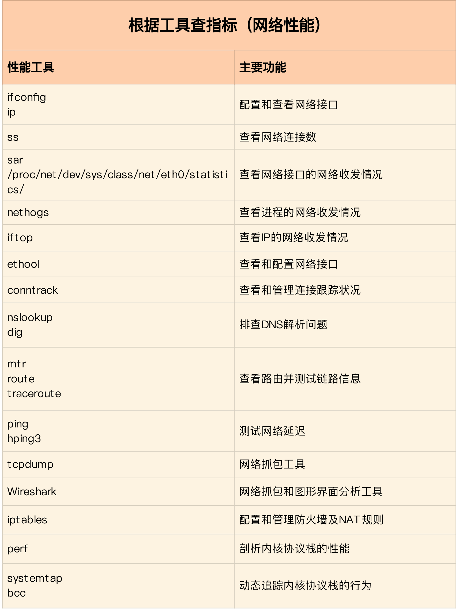

### 案例篇：DNS 解析时快时慢，我该怎么办？

1. 概念

> 

2. 涉及到的命令

```shell

```

3. 结论

> 对 DNS 解析的结果进行缓存。缓存是最有效的方法，但要注意，一旦缓存过期，还是要去 DNS 服务器重新获取新记录。不过，这对大部分应用程序来说都是可接受的。
>
> 对 DNS 解析的结果进行预取。这是浏览器等 Web 应用中最常用的方法，也就是说，不等用户点击页面上的超链接，浏览器就会在后台自动解析域名，并把结果缓存起来。
>
> 使用 HTTPDNS 取代常规的 DNS 解析。这是很多移动应用会选择的方法，特别是如今域名劫持普遍存在，使用 HTTP 协议绕过链路中的 DNS 服务器，就可以避免域名劫持的问题。
>
> 基于 DNS 的全局负载均衡（GSLB）。这不仅为服务提供了负载均衡和高可用的功能，还可以根据用户的位置，返回距离最近的 IP 地址。

### 案例篇：怎么使用 tcpdump 和 Wireshark 分析网络流量？

1. 概念

> 

2. 涉及到的命令

```shell
# ping 3 次（默认每次发送间隔1秒）
$ ping -c3 geektime.org

$ tcpdump -nn udp port 53 or host 35.190.27.188

$ tcpdump -nn udp port 53 or host 35.190.27.188 -w ping.pcap
```


3. 结论

> wireshark的使用推荐阅读林沛满的《Wireshark网络分析就这么简单》和《Wireshark网络分析的艺术》

### 案例篇：怎么缓解 DDoS 攻击带来的性能下降问题？

1. 概念

> 从攻击的原理上来看，DDoS 可以分为下面几种类型。
>
> 第一种，耗尽带宽。无论是服务器还是路由器、交换机等网络设备，带宽都有固定的上限。带宽耗尽后，就会发生网络拥堵，从而无法传输其他正常的网络报文。
>
> 第二种，耗尽操作系统的资源。网络服务的正常运行，都需要一定的系统资源，像是 CPU、内存等物理资源，以及连接表等软件资源。一旦资源耗尽，系统就不能处理其他正常的网络连接。
>
> 第三种，消耗应用程序的运行资源。应用程序的运行，通常还需要跟其他的资源或系统交互。如果应用程序一直忙于处理无效请求，也会导致正常请求的处理变慢，甚至得不到响应。比如，构造大量不同的域名来攻击 DNS 服务器，就会导致 DNS 服务器不停执行迭代查询，并更新缓存。这会极大地消耗 DNS 服务器的资源，使 DNS 的响应变慢。

2. 涉及到的命令

```shell
# -S参数表示设置TCP协议的SYN（同步序列号），-p表示目的端口为80
# -i u10表示每隔10微秒发送一个网络帧
$ hping3 -S -p 80 -i u10 192.168.0.30
```

3. 结论

> 

### 案例篇：网络请求延迟变大了，我该怎么办？

1. 概念

> 

2. 涉及到的命令

```shell
# -c表示发送3次请求，-S表示设置TCP SYN，-p表示端口号为80
$ hping3 -c 3 -S -p 80 baidu.com

# --tcp表示使用TCP协议，-p表示端口号，-n表示不对结果中的IP地址执行反向域名解析
$ traceroute --tcp -p 80 -n baidu.com
```

3. 结论

> - 使用 hping3 以及 wrk 等工具，确认单次请求和并发请求情况的网络延迟是否正常。
> - 使用 traceroute，确认路由是否正确，并查看路由中每一跳网关的延迟。
> - 使用 tcpdump 和 Wireshark，确认网络包的收发是否正常。
> - 使用 strace 等，观察应用程序对网络套接字的调用情况是否正常。

### 案例篇：如何优化 NAT 性能？（上）

1. 概念

> NAT 技术可以重写 IP 数据包的源 IP 或者目的 IP，被普遍地用来解决公网 IP 地址短缺的问题。
>
> 它的主要原理就是，网络中的多台主机，通过共享同一个公网 IP 地址，来访问外网资源。同时，由于 NAT 屏蔽了内网网络，自然也就为局域网中的机器提供了安全隔离。你既可以在支持网络地址转换的路由器（称为 NAT 网关）中配置 NAT，也可以在 Linux 服务器中配置 NAT。如果采用第二种方式，Linux 服务器实际上充当的是“软”路由器的角色。NAT 的主要目的，是实现地址转换。
>
> 根据实现方式的不同，NAT 可以分为三类：
>
> - 静态 NAT，即内网 IP 与公网 IP 是一对一的永久映射关系；
> - 动态 NAT，即内网 IP 从公网 IP 池中，动态选择一个进行映射；
> - 网络地址端口转换 NAPT（Network Address and Port Translation），即把内网 IP 映射到公网 IP 的不同端口上，让多个内网 IP 可以共享同一个公网 IP 地址。

2. 涉及到的命令

```shell

```

3. 结论

> 

### 案例篇：如何优化 NAT 性能？（下）

1. 概念

> Linux 中的 NAT ，基于内核的连接跟踪模块实现。所以，它维护每个连接状态的同时，也对网络性能有一定影响。

2. 涉及到的命令

```shell

```

3. 结论

> 

### 套路篇：网络性能优化的几个思路（上）

1. 概念




2. 涉及到的命令

```shell

```

3. 结论

> 在优化网络的性能时，你可以结合 Linux 系统的网络协议栈和网络收发流程，然后从应用程序、套接字、传输层、网络层再到链路层等每个层次，进行逐层优化。
>
> - 在应用程序中，主要优化 I/O 模型、工作模型以及应用层的网络协议；
> - 在套接字层中，主要优化套接字的缓冲区大小。

### 套路篇：网络性能优化的几个思路（下）

1. 概念


2. 涉及到的命令

```shell

```

3. 结论

> 实际上，我们分析和定位网络瓶颈，也是基于这些网络层进行的。而定位出网络性能瓶颈后，我们就可以根据瓶颈所在的协议层，进行优化。具体而言：
>
> - 在应用程序中，主要是优化 I/O 模型、工作模型以及应用层的网络协议；
> - 在套接字层中，主要是优化套接字的缓冲区大小；
> - 在传输层中，主要是优化 TCP 和 UDP 协议；
> - 在网络层中，主要是优化路由、转发、分片以及 ICMP 协议；
> - 最后，在链路层中，主要是优化网络包的收发、网络功能卸载以及网卡选项。

