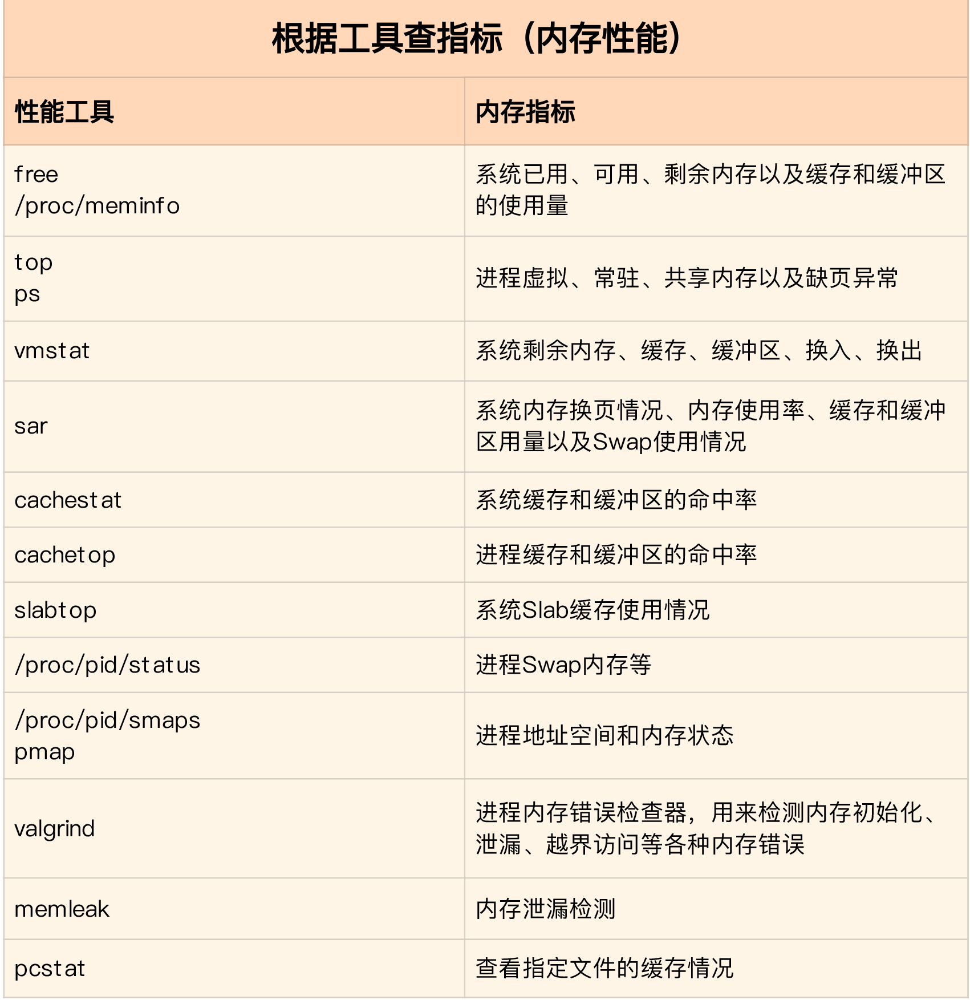
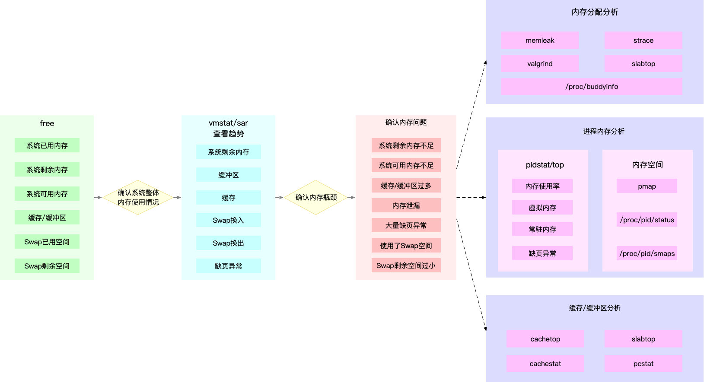

### 基础篇：怎么理解内存中的Buffer和Cache？

1. 概念

> /proc 是 Linux 内核提供的一种特殊文件系统，是用户跟内核交互的接口。比方说，用户可以从 /proc 中查询内核的运行状态和配置选项，查询进程的运行状态、统计数据等，当然，你也可以通过 /proc 来修改内核的配置。


> - Buffers 是对原始磁盘块的临时存储，也就是用来缓存磁盘的数据，通常不会特别大（20MB 左右）。这样，内核就可以把分散的写集中起来，统一优化磁盘的写入，比如可以把多次小的写合并成单次大的写等等。
> - Cached 是从磁盘读取文件的页缓存，也就是用来缓存从文件读取的数据。这样，下次访问这些文件数据时，就可以直接从内存中快速获取，而不需要再次访问缓慢的磁盘。
> - SReclaimable 是 Slab 的一部分。Slab 包括两部分，其中的可回收部分，用 SReclaimable 记录；而不可回收部分，用 SUnreclaim 记录。


> Linux系统中文件和磁盘有什么区别？
>
> 磁盘是一个块设备，可以划分为不同的分区；在分区之上再创建文件系统，挂载到某个目录，之后才可以在这个目录中读写文件。
>
> 其实 Linux 中“一切皆文件”，而文章中提到的“文件”是普通文件，磁盘是块设备文件，这些大家可以执行 "ls -l <路径>" 查看它们的区别（输出的含义如果不懂请 man ls 查询）。
>
> 在读写普通文件时，会经过文件系统，由文件系统负责与磁盘交互；而读写磁盘或者分区时，就会跳过文件系统，也就是所谓的“裸I/O“。这两种读写方式所使用的缓存是不同的，也就是专栏中所讲的 Cache 和 Buffer 区别。


2. 涉及到的命令

```shell
# 清理文件页、目录项、Inodes等各种缓存
$ echo 3 > /proc/sys/vm/drop_caches

# 每隔1秒输出1组数据
$ vmstat 1procs -----------memory---------- ---swap-- -----io---- -system-- ------cpu-----
r b swpd free buff cache si so bi bo in cs us sy id wa st
0 0 0 7743608 1112 92168 0 0 0 0 52 152 0 1 100 0 0 
0 0 0 7743608 1112 92168 0 0 0 0 36 92 0 0 100 0 0
```

3. 结论

> Buffer 是对磁盘数据的缓存，而 Cache 是文件数据的缓存，它们既会用在读请求中，也会用在写请求中。
>
> Buffer 和 Cache 的设计目的，是为了提升系统的 I/O 性能。它们利用内存，充当起慢速磁盘与快速 CPU 之间的桥梁，可以加速 I/O 的访问速度。


### 案例篇：如何利用系统缓存优化程序的运行效率？

1. 概念


2. 涉及到的命令

```shell
# 以 1 秒的时间间隔，输出了 3 组缓存统计数据
$ cachestat 1 3 
TOTAL MISSES HITS DIRTIES BUFFERS_MB CACHED_MB 
2 0 2 1 17 279
2 0 2 1 17 279
2 0 2 1 17 279

TOTAL ，表示总的 I/O 次数；
MISSES ，表示缓存未命中的次数；
HITS ，表示缓存命中的次数；
DIRTIES， 表示新增到缓存中的脏页数；
BUFFERS_MB 表示 Buffers 的大小，以 MB 为单位；
CACHED_MB 表示 Cache 的大小，以 MB 为单位。

# 默认按照缓存的命中次数（HITS）排序，展示了每个进程的缓存命中情况
$ cachetop

# 查看文件在内存中的缓存大小以及缓存比例
$ pcstat /bin/ls
```

3. 结论

> - cachestat 提供了整个系统缓存的读写命中情况。
> - cachetop 提供了每个进程的缓存命中情况。cachetop 工具并不把直接 I/O 算进来


### 案例篇：内存泄漏了，我该如何定位和处理？

1. 概念

> 栈内存由系统自动分配和管理。一旦程序运行超出了这个局部变量的作用域，栈内存就会被系统自动回收，所以不会产生内存泄漏的问题。

> 堆内存由应用程序自己来分配和管理。除非程序退出，这些堆内存并不会被系统自动释放，而是需要应用程序明确调用库函数 free() 来释放它们。如果应用程序没有正确释放堆内存，就会造成内存泄漏。

2. 涉及到的命令

```shell
# 每隔3秒输出一组数据
$ vmstat 3

# -a 表示显示每个内存分配请求的大小以及地址
# -p 指定案例应用的PID号
$ /usr/share/bcc/tools/memleak -a -p $(pidof app)
```

3. 结论

> 为了避免内存泄漏，最重要的一点就是养成良好的编程习惯，比如分配内存后，一定要先写好内存释放的代码，再去开发其他逻辑。还是那句话，有借有还，才能高效运转，再借不难。


### 案例篇：为什么系统的Swap变高了（上）

1. 概念

> 不过，反过来讲，当发生了内存泄漏时，或者运行了大内存的应用程序，导致系统的内存资源紧张时，系统又会如何应对呢？在内存基础篇我们已经学过，这其实会导致两种可能结果，**内存回收和 OOM 杀死进程**。

> Swap 说白了就是把一块磁盘空间或者一个本地文件（以下讲解以磁盘为例），当成内存来使用。它包括换出和换入两个过程。


2. 涉及到的命令

```shell
# 查看处理器在 Node 的分布情况，以及每个 Node 的内存使用情况
$ numactl --hardware

# 前面提到的三个内存阈值（页最小阈值、页低阈值和页高阈值），都可以通过内存域在 proc 文件系统中的接口 /proc/zoneinfo 来查看。
$ cat /proc/zoneinfo
```

3. 结论

> 在内存资源紧张时，Linux 通过直接内存回收和定期扫描的方式，来释放文件页和匿名页，以便把内存分配给更需要的进程使用。
>
> - 文件页的回收比较容易理解，直接清空，或者把脏数据写回磁盘后再释放。
> - 而对匿名页的回收，需要通过 Swap 换出到磁盘中，下次访问时，再从磁盘换入到内存中。

4. 精选留言

> - swap应该是针对以前内存小的一种优化吧,不过现在内存没那么昂贵之后,所以就没那么大的必要开启了；
> - numa感觉是对系统资源做的隔离分区,不过目前虚拟化和docker这么流行。而且node与node之间访问更耗时,针对大程序不一定启到了优化作用,针对小程序,也没有太大必要。

### 案例篇：为什么系统的Swap变高了（下）

1. 概念

2. 涉及到的命令

```shell

```

3. 结论

> 通常，降低 Swap 的使用，可以提高系统的整体性能。要怎么做呢？这里，我也总结了几种常见的降低方法。
>
> - 禁止 Swap，现在服务器的内存足够大，所以除非有必要，禁用 Swap 就可以了。
> - 随着云计算的普及，大部分云平台中的虚拟机都默认禁止 Swap。如果实在需要用到 Swap，可以尝试降低 swappiness 的值，减少内存回收时 Swap 的使用倾向。
> - 响应延迟敏感的应用，如果它们可能在开启 Swap 的服务器中运行，你还可以用库函数 mlock() 或者 mlockall() 锁定内存，阻止它们的内存换出。

### 套路篇：如何“快准狠”找到系统内存的问题？

1. 概念






2. 涉及到的命令

```shell

```

3. 结论

> 常见的优化思路有这么几种。
>
> - 最好禁止 Swap。如果必须开启 Swap，降低 swappiness 的值，减少内存回收时 Swap 的使用倾向。
> - 减少内存的动态分配。比如，可以使用内存池、大页（HugePage）等。
> - 尽量使用缓存和缓冲区来访问数据。比如，可以使用堆栈明确声明内存空间，来存储需要缓存的数据；或者用 Redis 这类的外部缓存组件，优化数据的访问。
> - 使用 cgroups 等方式限制进程的内存使用情况。这样，可以确保系统内存不会被异常进程耗尽。
> - 通过 /proc/pid/oom_adj ，调整核心应用的 oom_score。这样，可以保证即使内存紧张，核心应用也不会被 OOM 杀死。


### 答疑（三）：文件系统与磁盘的区别是什么？

1. 概念

> 一旦发现内存紧张，系统会通过三种方式回收内存。这三种方式分别是 ：
>
> - 基于 LRU（Least Recently Used）算法，回收缓存；
> - 基于 Swap 机制，回收不常访问的匿名页；
> - 基于 OOM（Out of Memory）机制，杀掉占用大量内存的进程。

2. 涉及到的命令

```shell

```

3. 结论

> 

